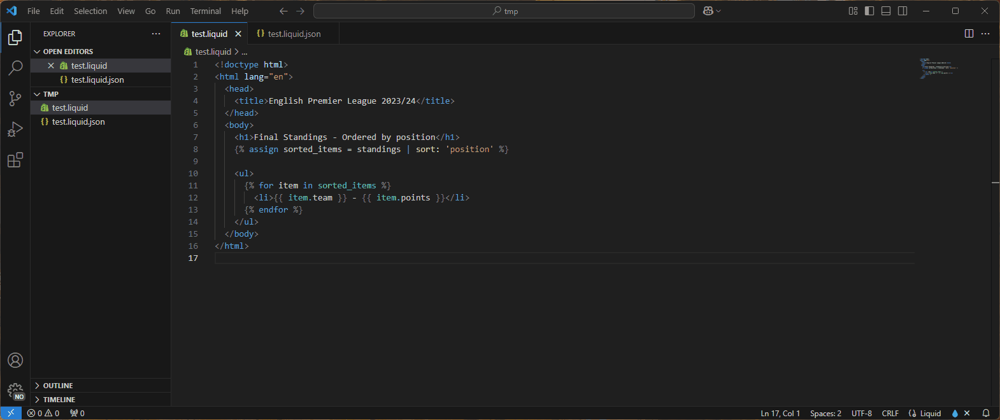

# HTML Liquid Preview for Visual Studio Code

Gives a rendered live preview for HTML based liquid templates. It uses the [liquidjs](https://www.npmjs.com/package/liquidjs) npm package to do the rendering. Formatting of the template can be done by a separate command and is powered by [Prettier](https://www.npmjs.com/package/prettier) and the [Shopify Prettier Liquid Plugin](https://www.npmjs.com/package/@shopify/prettier-plugin-liquid)


This extension was inspired by [YE Quing's](https://github.com/yq314) - [Braze Liquid Preview](https://github.com/yq314/vscode-braze-liquid-preview)

Which in turn was inspired by [Trevor Kirchner's](https://github.com/kirchner-trevor) - [Shopify Liquid Preview](https://github.com/kirchner-trevor/vscode-shopify-liquid-preview).

This extension is designed to be complimentary to Liquid language support extensions such as [Liquid](https://marketplace.visualstudio.com/items?itemName=sissel.shopify-liquid) and [Shopify Liquid](https://marketplace.visualstudio.com/items?itemName=Shopify.theme-check-vscode) which provide features including syntax highlighting and auto-completion.

## Purpose

When editing a template the output of which is HTML, I like the live rendered preview you get with the Braze plugin. However I didn't need the Braze extensions and I did want it to support all the standard Liquid syntax. 

I also tended to have some issues with other extensions in terms of formatting. Sometimes they auto-format when I don't want them to. Sometimes they format the liquid but not the HTML. I've added a format option as a separate command that can be run manually so as not to interfere with any other formatter that may have already been setup.

## Features

- Live preview for HTML Liquid templates, updating as you type
- Support for fake data. Assuming your template file name is `template.liquid`, add a file `template.liquid.json` in the same directory to be a context of the template
- Ability to format the source template

## Usage

Use the keybinding `ctrl+shift+p` to launch the command pallet. this extension makes 2 new commands available:
- HTML Liquid: Preview
- HTML Liquid: Format Template



## Running locally

Running with `npm`
```
npm install
npm run test
```

See [Testing Extensions](https://code.visualstudio.com/api/working-with-extensions/testing-extension) for more info on testing VS Code extensions.